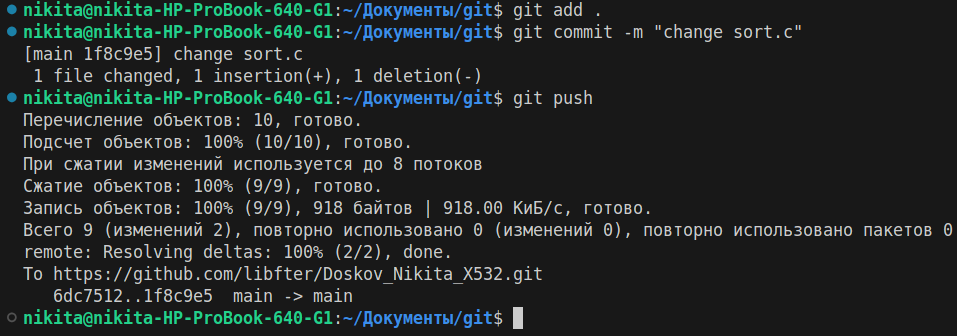

# Результаты работы
## На оценку 3

1. ввел git status чтобы посмотроеть на какой ветке я нахожусь
2. посмотрел git log
3. создал файл sort.c
4. после этого проверил git status
5. проиндексировал sort.c командой git add

6. проверил git status

7. закоммитил файл sort.c

8. проверил git status
9. изменил sort.c, добавив комментарий
10. проверил git status

11. проиндексировал файл sort.c
12. проверил git status
13. изменил sort.c
14. закоммитил с сообщением
15. проверил git status, затем git log

16. проиндексировал все файлы и закоммитил
17. запушил изменения на удаленный репозиторий