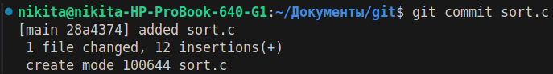
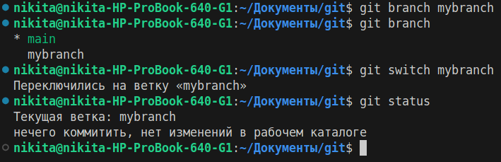
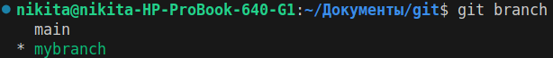
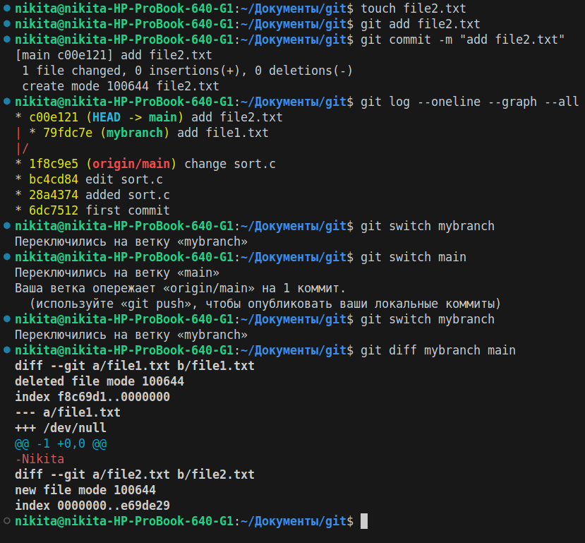
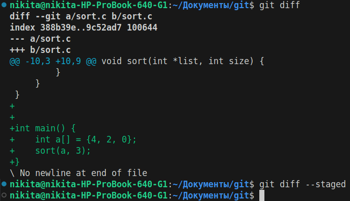
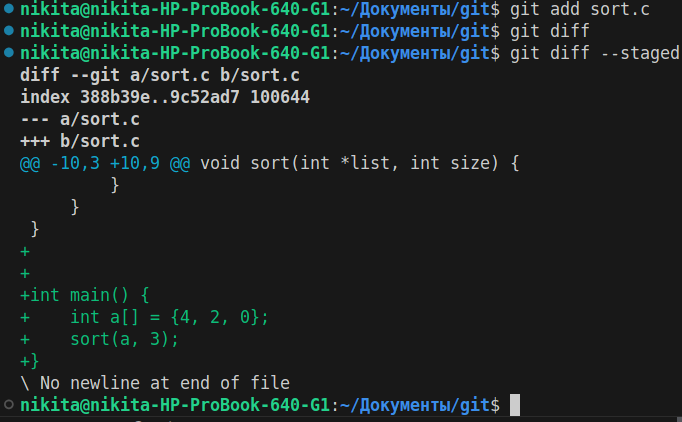
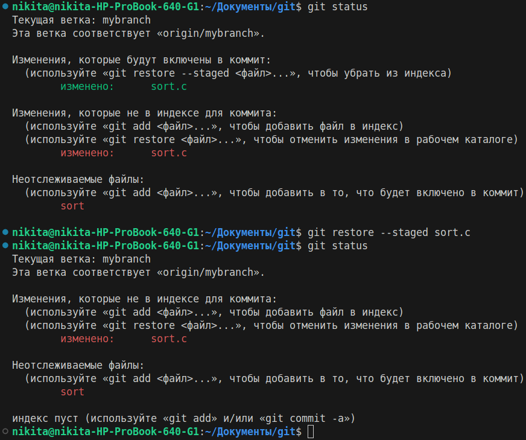
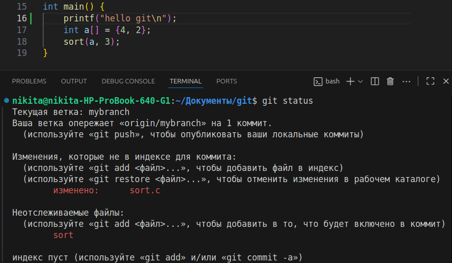
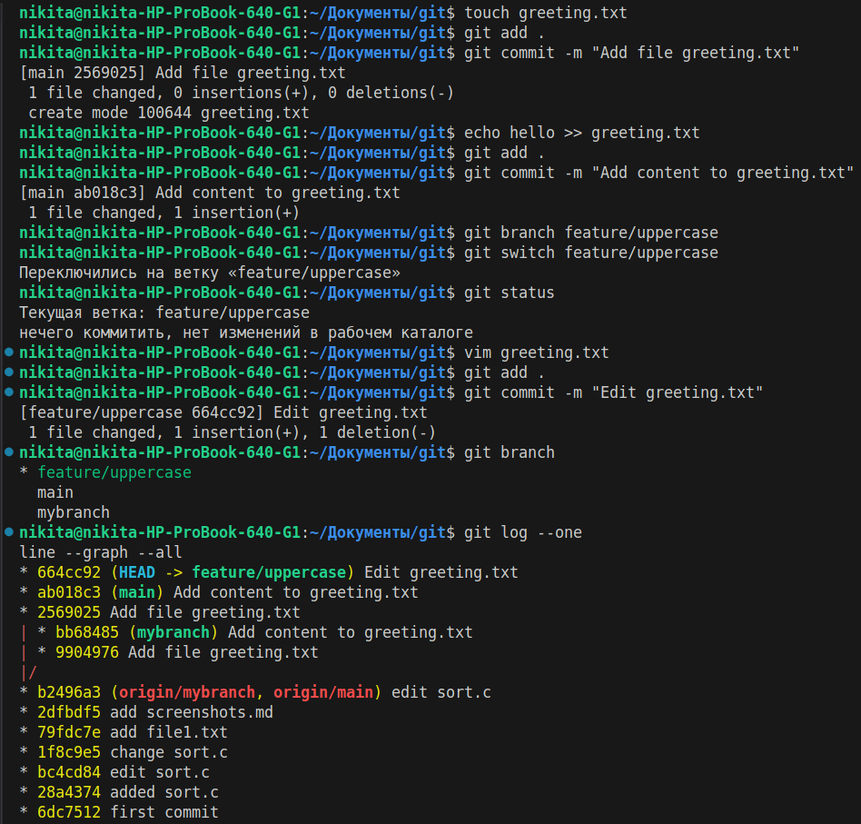

# Результаты работы

*****

## На оценку 3 (часть 1)

1. ввел git status чтобы посмотроеть на какой ветке я нахожусь
2. посмотрел git log
3. создал файл sort.c
4. после этого проверил git status
5. проиндексировал sort.c командой git add

6. проверил git status

7. закоммитил файл sort.c

8. проверил git status
9. изменил sort.c, добавив комментарий
10. проверил git status

11. проиндексировал файл sort.c
12. проверил git status
13. изменил sort.c
14. закоммитил с сообщением
15. проверил git status, затем git log

16. проиндексировал все файлы и закоммитил
17. запушил изменения на удаленный репозиторий

## На оценку 3 (часть 2)

1. создал ветку mybranch
2. посмотрел git branch, убедился что появилась ветка mybranch
3. переключился на ветку mybranch
4. проверил git status

5. убедился что нахожусь на ветке mybranch

6. создал file1.txt со своим именем
7. проиндексировал file1.txt, затем закоммитил
8. проверил git log, ветка указывает на новый коммит
9. переключился на ветку main
10. проверил git log, ветка указывает на предыдущий коммит

11. создал file2.txt, проиндексировал его и закоммитил
12. проверил git log, теперь две ветки указывают на разные коммиты
13. переключился на ветку mybranch
14. увидел что файл file2.txt пропал
15. посмотрел git diff между ветками main и mybranch

16. добавил screenshots.md и закоммитил, затем запушил ветку mybranch

*****

## На оценку 4 (часть 1)

1. переключился на ветку mybranch
2. добавил в sort.c функцию main()

3. посмотрел git diff, показал отличия между текущим sort.c и sort.c из коммита
4. посмотрел git diff --staged, пустой

5. проиндексировал sort.c
6. посмотрел git diff, теперь он пустой
7. посмотрел git diff --staged, показал отличия между текущим sort.c и sort.c из коммита

8. удалил одно число из массива в sort.c
9. проверил git diff, отличия есть
10. проверил git diff --staged, отличий в массивах нет
11. git diff показывает отличия в файлах до изменений и после, git diff --staged показывает отличия в файлах предыдущего коммита и проиндексированных файлов

12. посмотрел git status
13. запустил git restore для проиндексированного sort.c
14. посмотрел git status, sort.c теперь не проиндексирован

15. проиндексировал sort.c и закоммитил изменения
16. посмотрел git log

17. изменил sort.c
18. добавлена строка printf("hello git\n");
19. посмотрел git status

20. запустил git restore для sort.c
21. строки printf("hello git\n"); теперь нет
22. посмотрел git status
23. запушил ветку

## На оценку 4 (часть 2)

1. создал файл greeting.txt, проиндексировал его и закоммитил изменения
2. добавил в файл greeting.txt строку hello, проиндексировал его и закоммитил изменения
3. создал ветку features/uppercase
4. переключился на ветку features/uppercase
5. проверил git status
6. отредактировал greeting.txt, теперь строка HELLO
7. проиндексировал и закоммитил
8. посмотрел git branch
9. вывел журнал

10. переключился на главную ветку
11. вывел содержимое greeting.txt -> hello
12. сравнил ветки main и features/uppercase
13. объединил ветки main и features/uppercase в main
14. вывел содержимое greeting.txt -> HELLO
15. удалил ветку features/uppercase
16. объединил ветки main и mybranch в main

17. вывел журнал
18. запушил (--force потому что откатывал запушенные коммиты до выполнения задания)
19. пишу этот документ с результатами работы и в дальнейшем проиндексирую его, закоммичу и запушу